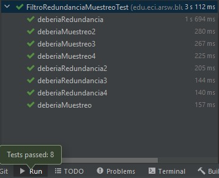

### Escuela Colombiana de Ingeniería

### Arquitecturas de Software
## Laboratorio Componentes y conectores  Middleware- gestión de planos
### Dependencias
* [Ejercicio introductorio al manejo de Spring y la configuración basada en anotaciones](https://github.com/ARSW-ECI-beta/DIP_DI-SPRING_JAVA-GRAMMAR_CHECKER).

### Descripción
En este ejercicio se va a construír un modelo de clases para la capa lógica de una aplicación que permita gestionar planos arquitectónicos de una prestigiosa compañia de diseño. 


### Parte I.

1. Configure la aplicación para que funcione bajo un esquema de inyección de dependencias, tal como se muestra en el diagrama anterior.


	Lo anterior requiere:

	* Agregar las dependencias de Spring.
	* Agregar la configuración de Spring.
	* Configurar la aplicación -mediante anotaciones- para que el esquema de persistencia sea inyectado al momento de ser creado el bean 'BlueprintServices'.

> Se agregaron las anotaciones @Component("inMemory") en la clase InMemoryBlueprintPersistence y en la clase BlueprintsServices las anotaciones @Autowired y @Qualifier("inMemory")
2. Complete los operaciones getBluePrint() y getBlueprintsByAuthor(). Implemente todo lo requerido de las capas inferiores (por ahora, el esquema de persistencia disponible 'InMemoryBlueprintPersistence') agregando las pruebas correspondientes en 'InMemoryPersistenceTest'.

**Implementacion**
```java

    @Override
    public Set<Blueprint> getAllBlueprints() throws BlueprintNotFoundException {
        Set<Blueprint> authorBlueprints = new HashSet<>(blueprints.values());
        if (authorBlueprints.isEmpty()) {
            throw new BlueprintNotFoundException("No existe ningún plano del autor");
        }
        return authorBlueprints;
    }

    @Override
    public ArrayList<Blueprint> getBluePrinstByAuthor(String author) throws BlueprintNotFoundException {
        ArrayList<Blueprint> bluePrints = new ArrayList<Blueprint>();
        for(Map.Entry<Tuple<String, String>, Blueprint> key: blueprints.entrySet()){
            if(key.getKey().o1 == author){
                bluePrints.add(key.getValue());

            }
        }
        return bluePrints;
    }

```

**Test**


3. Haga un programa en el que cree (mediante Spring) una instancia de BlueprintServices, y rectifique la funcionalidad del mismo: registrar planos, consultar planos, registrar planos específicos, etc.
```java
public class Programa {
    public static void main(String[] args) {
        ApplicationContext ac = new ClassPathXmlApplicationContext("applicationContext.xml");
        BlueprintsServices bpServices = ac.getBean(BlueprintsServices.class);
        FiltrosServices FlServices=ac.getBean(FiltrosServices.class);
        String author1 = "Nik";
        String author2 = "Verb";
        String name1 = "Whithepalms";
        String name2 = "Bigman";

        Point[] puntos = new Point[]{ new Point(-10, 10),new Point(-10, 10),new Point(-10, 10)};
        Blueprint blueprintone = new Blueprint(author1, name1, puntos);
        Blueprint blueprinttwo = new Blueprint(author2, name2, puntos);
        FiltroRedundancia pre=new FiltroRedundancia();
        pre.setBluepri(blueprintone);
        Filtrosubmuestreo pre2=new Filtrosubmuestreo();
        pre2.setBluepri(blueprinttwo);
        try {
            bpServices.addNewBlueprint(blueprintone);
            bpServices.addNewBlueprint(blueprinttwo);
            for (Point p:blueprinttwo.getPoints()){
              System.out.println(p.getX()+" "+p.getY());
            }
            for (Point p:blueprintone.getPoints()){
                System.out.println(p.getX()+" "+p.getY());
            }

        } catch (BlueprintPersistenceException e) {
            e.printStackTrace();
        }
    }
}

```
4. Se quiere que las operaciones de consulta de planos realicen un proceso de filtrado, antes de retornar los planos consultados. Dichos filtros lo que buscan es reducir el tamaño de los planos, removiendo datos redundantes o simplemente submuestrando, antes de retornarlos. Ajuste la aplicación (agregando las abstracciones e implementaciones que considere) para que a la clase BlueprintServices se le inyecte uno de dos posibles 'filtros' (o eventuales futuros filtros). No se contempla el uso de más de uno a la vez:
	* (A) Filtrado de redundancias: suprime del plano los puntos consecutivos que sean repetidos.
	  
	* (B) Filtrado de submuestreo: suprime 1 de cada 2 puntos del plano, de manera intercalada.
	  

5. Agrege las pruebas correspondientes a cada uno de estos filtros, y pruebe su funcionamiento en el programa de prueba, comprobando que sólo cambiando la posición de las anotaciones -sin cambiar nada más-, el programa retorne los planos filtrados de la manera (A) o de la manera (B).

